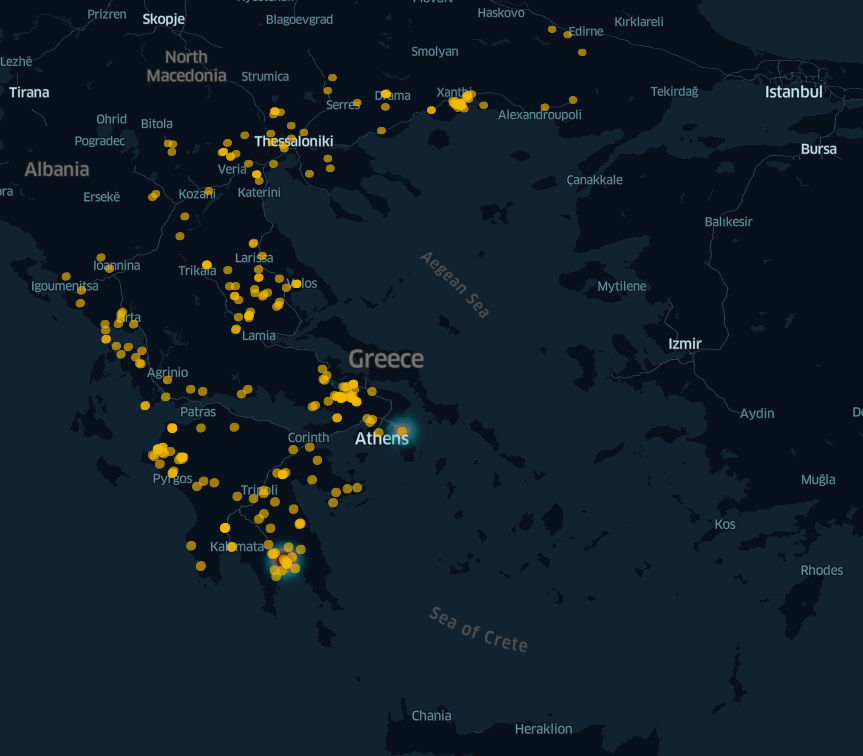
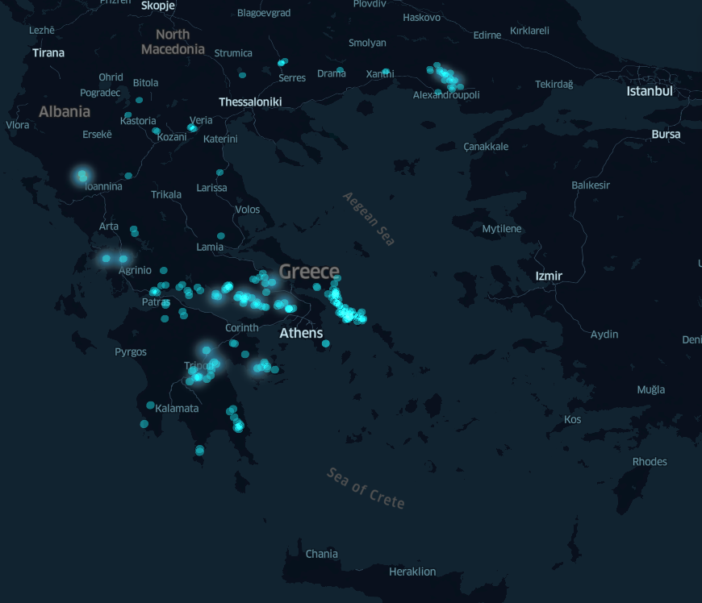
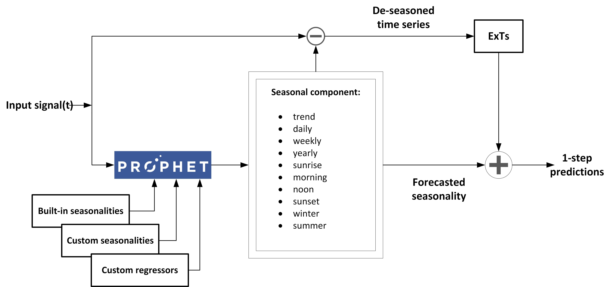
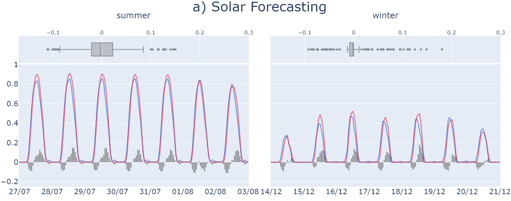
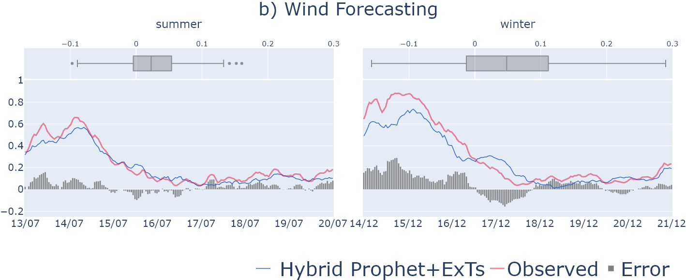

# greek-solar-wind-energy-forecasting

Repository hosting the code and dataset of the paper titled `"Short-term Renewable Energy Forecasting in Greece using Prophet Decomposition and Tree-based Ensembles"`, submitted in the AI-CARES 2021 Conference.

## Onshore solar and wind installations in Greece (year: 2020)
---

## Hybrid FB Prophet Decomposition with Extra Trees Ensemple model architecture
---

## Solar and wind energy generation forecast results
---

